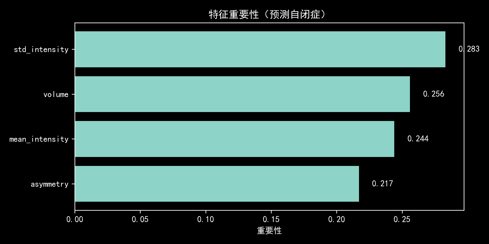
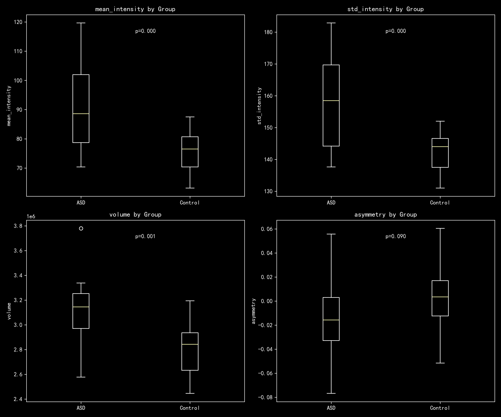

# ABIDE-ASD-Analysis
自闭症脑结构影像分析项目
# 🧠 ABIDE自闭症脑结构影像分析

[](https://www.python.org/downloads/)
[](https://jupyter.org/)
[](https://opensource.org/licenses/MIT)

## 📋 项目概述
使用ABIDE数据库的结构磁共振数据，通过影像组学方法提取脑结构特征，探索自闭症谱系障碍(ASD)患者与正常对照组的脑结构差异，并构建机器学习分类模型。

## 🔬 方法
- **数据**: ABIDE Caltech站点，38例（19 ASD / 19 Control）
- **特征**: 平均强度、标准差、脑体积、左右半球不对称性
- **分析**: t检验、随机森林、SVM、逻辑回归

## 📊 主要结果

- 3个特征在两组间存在显著差异 (p < 0.01)
- 逻辑回归模型最佳 AUC = 0.812
- 脑信号标准差是最重要的预测特征


### 组间差异
| 特征 | p值 | 显著性 |
|------|-----|--------|
| 平均强度 | 0.0003 | *** |
| 标准差 | 0.0002 | *** |
| 脑体积 | 0.0011 | ** |
| 不对称性 | 0.0896 | ns |

### 模型性能
- **逻辑回归**: AUC = 0.812 (±0.062) 🏆
- SVM: AUC = 0.758 (±0.218)
- 随机森林: AUC = 0.733 (±0.180)

### 特征重要性


### 组间对比


## 文件说明
- `body.ipynb`: 完整分析代码
- `results/`: 所有输出结果

## 依赖库
numpy, pandas, nibabel, scipy, scikit-learn, matplotlib,jupyter

## 🚀 快速开始

```bash
# 克隆仓库
git clone https://github.com/你的用户名/ABIDE-ASD-Analysis.git

# 安装依赖
pip install -r requirements.txt

# 下载数据（详见 data/README.md）
# 运行分析
jupyter notebook body.ipynb
